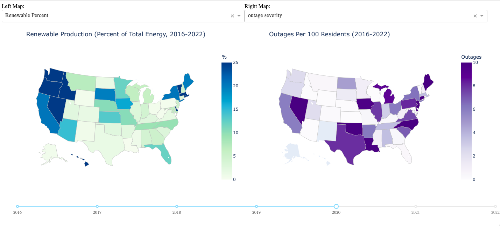

# Project Name: Grid Expectations

## Members

- Ethan Evans ethane@uchicago.edu
- Ganon Evans ganon@uchicago.edu
- Jinny Kim ekim1208@uchicago.edu
- Callie Leone clleone@uchicago.edu

Overview:

This project aims to examine power outages and its association with energy generation
sources in the United States. By analyzing the frequency and severity of power outages,
we aim to explore patterns in grid reliability and generation mix across different
regions and time periods. 

To visualize the results, we have created three interactive maps (e.g., heat map)
that visualize the changes in power outages and storm damage as well as the 
shifts in electricity generation sources over time. We have aggregated data by 
state to account for their outage history and their energy production and consumption. 
These tools will allow users to easily examine regional differences in renewable energy 
adoption and grid reliability in the U.S.

The visualization should look something like this:

## Data Sources 

OE-417 (data/outages)
Outage data (duration, number of customers affected) by U.S. region
Department of Energy
Link: https://doe417.pnnl.gov/instructions
      (more detailed urls in data/outages/doe_source_urls.txt)

State Energy Data System (data/renewables)
Total energy production with renewables broken out by state
U.S. Energy Information Administration
URL: 
    https://www.eia.gov/state/seds/seds-data-complete.php
    (more detailed urls in data/outages/eia_seds_source_urls.txt)

U.S. Census State Population Data (data/state_pops)
Population by state over each decade.
U.S. Census Bureau
URL: 
    https://www.census.gov/data/tables.html
    (more detailed urls in data/outages/census_source_urls.txt)

U.S. State Geographic Information (data/state_regions)
Shapefiles of each U.S. State for use in visualization
TODO
URL: 
    TODO

Storm Bulk Data (data/storms)
Information on dollar damage amount of storms in given years. 
National Oceanic and Atmospheric Administration
URL: 
    https://www.ncei.noaa.gov/access/billions/mapping
    (more detailed urls in data/outages/noaa_source_urls.txt)

## How To Run:

"uv sync" (install uv if necessary)
"uv run gridx"

A new tab will open in your browser with the program. You should have two drop-down boxes that will allow you to select from the outage, renewable percentage, and storm damage heat maps. From there, a toggle at the bottom of the screen allows you to progress through the years and compare over time. Hovering over a state reveals specific information for that map in the selected year.

To run pytests for program:
"uv run pytest"
